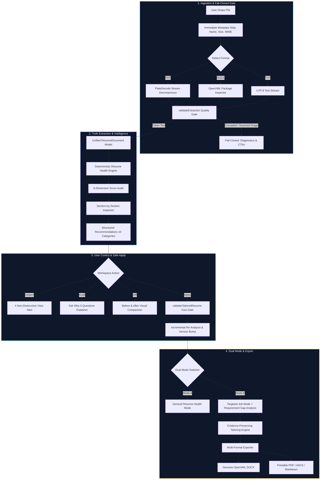

<div align="center">

# ⚡ Resumix

### Real-Time Resume Intelligence • Deterministic ATS Engine • Evidence-First Tailoring

<p align="center">
  <b>The enterprise-grade resume intelligence platform where documents are verified, not fabricated.</b><br>
  Built on a strict architectural principle: <i>The uploaded resume is the source of truth. AI is an assistant for phrasing, never the database of facts.</i>
</p>

<p align="center">
  <a href="#-quick-start"><b>Quick Start</b></a> •
  <a href="#-core-capabilities"><b>Capabilities</b></a> •
  <a href="#-architecture--pipeline"><b>Architecture</b></a> •
  <a href="#-templates"><b>Templates</b></a> •
  <a href="#-verification-suite"><b>Test Results</b></a> •
  <a href="#-resumix-vs-traditional-ai-builders"><b>Comparison</b></a>
</p>

<!-- Sleek Cohesive Badges -->
<p align="center">
  
  
  
  
  
  
  
  
  
</p>

</div>

---

## 🌟 Highlights at a Glance

<table>
  <tr>
    <td width="50%">
      <b>⚡ Real-Time Live Intelligence</b><br>
      Continuous 400ms debounced analysis re-evaluates resume health upon every keystroke with version-fencing race condition protection.
    </td>
    <td width="50%">
      <b>🛡️ Zero AI Hallucination Guarantee</b><br>
      Skills, dates, companies, metrics, and degrees are extracted strictly from evidence. Resumix refuses to invent credentials.
    </td>
  </tr>
  <tr>
    <td width="50%">
      <b>📊 Deterministic ATS Scoring</b><br>
      6-dimension algorithmic audit (ATS Compatibility, Content Quality, Structure, Keyword Alignment, Evidence Strength, Recruiter Readability).
    </td>
    <td width="50%">
      <b>🔒 Fail-Closed Extraction Engine</b><br>
      Native stream decompressor (`FlateDecode` PDF, OpenXML DOCX). Stops corrupted files & image scans without generating phantom profiles.
    </td>
  </tr>
  <tr>
    <td width="50%">
      <b>🎨 5 Professional Typography Templates</b><br>
      ATS Classic, Modern Pro, Technical Grid, Minimal Executive, and Student/Fresher with instant template switching.
    </td>
    <td width="50%">
      <b>📦 True Multi-Format Export</b><br>
      100% factual fidelity across native binary OpenXML Word DOCX, clean print-optimized PDF, recruiter-ready Plain Text, and Markdown.
    </td>
  </tr>
</table>

---

## ⚖️ Resumix vs. Traditional AI Builders

| Capability | Generic AI Resume Builders | ⚡ Resumix |
|---|---|---|
| **Primary Authority** | Non-deterministic AI Prompting | **Deterministic Evidence Parser** |
| **Fact Preservation** | Frequently fabricates unheld skills & metrics | **Strictly Gatekept** via `validateTailoredResume` |
| **Document Reading** | Fails or hallucinates on complex PDF/DOCX | **FlateDecode Stream + OpenXML Validator** |
| **Scanned PDF Handling** | Hallucinates generic placeholder resumes | **Fail-Closed Diagnostic** + Manual Paste Fallback |
| **ATS Score Validity** | Random fluctuating percentages (70-95%) | **Mathematical 6-Dimension Algorithmic Audit** |
| **User Control** | Silently mutates source resume | **4 Distinct Non-Destructive Workspace Tabs** |
| **Recommendation Rationale** | "Make it sound more professional" | **5 Mandatory Evidence-First Rationale Answers** |
| **Data Privacy** | Stores raw resumes in generic LLM pools | **User-Isolated Subcollections & Non-PII Learning** |

---

## 🏗️ Architecture & Pipeline

Resumix replaces opaque LLM calls with an end-to-end evidence pipeline:



---

## 🚀 Core Capabilities

### 1. Section-by-Section Analysis Inspector
Inspect every section of the resume with complete structural fidelity:

```
┌────────────────────────────────────────────────────────────────────────┐
│  Work Experience                      [VERIFIED]                       │
│  8 entries analyzed • 2 improvement opportunities                      │
│                                                                        │
│  ✓ 8 professional roles with verified duration and company markers.   │
│  ! 2 bullets lack measurable business or engineering impact metrics.   │
│                                                                        │
│  [View Recommendations]                                                │
└────────────────────────────────────────────────────────────────────────┘
```
- **Professional Summary**: Word count, executive density, candidate focus.
- **Work Experience**: Roles analyzed, metric quantification, active verb audits.
- **Projects & Portfolio**: Verified projects, framework tags, hands-on evidence.
- **Technical Skills**: Verified skills mapped to evidence in experience.
- **Education**: Degrees, universities, graduation dates.

---

### 2. User Control: 4 Distinct Workspace Views
Resumix enforces **zero silent modifications** through 4 isolated views:

```
┌─────────────────┬─────────────────┬──────────────────────────┬─────────────────┐
│ Analyzed Resume │ Original Resume │ Suggested Improvements  │ Tailored Resume │
└─────────────────┴─────────────────┴──────────────────────────┴─────────────────┘
```
1. **Analyzed Resume**: Live score dials, structural metrics, and section-by-section audit cards.
2. **Original Resume**: Completely untouched source text with character/word counter and zero-mutation badge.
3. **Suggested Improvements**: Prioritized recommendation cards with Before/After visual comparison and safe 1-click apply.
4. **Tailored Resume**: Professional preview of job-aligned resume with instant 5-template switching and export.

---

### 3. Safe 1-Click Recommendation Apply
Every recommendation is categorized into one of **10 Disciplines**:
`STRUCTURE` • `CONTENT` • `ATS` • `KEYWORD` • `CLARITY` • `IMPACT` • `EVIDENCE` • `FORMATTING` • `MISSING_INFORMATION` • `TARGET_ALIGNMENT`

#### The 5 Anti-Fabrication Questions Answered for Every Finding:
```
1. What is the problem?
   → 2 experience bullet points describe duties without quantifiable outcomes.
2. Why does it matter?
   → Recruiters prioritize scale, throughput, and performance over generic duty lists.
3. What evidence supports this?
   → Identified bullet: "Was responsible for database query optimizations and caching..."
4. What can Resumix safely change?
   → Restructure into Action Verb + Context + Outcome framework using verified details.
5. What will Resumix NOT invent?
   → Resumix will not fabricate numerical percentages, revenue, or latency metrics.
```

Applying a recommendation runs `validateTailoredResume` to guarantee metrics, company names, dates, and technologies are protected before committing the change.

---

### 4. Dual-Mode Analysis Engine

<table width="100%">
  <tr>
    <td width="50%">
      <h3>Mode A: General Resume Health</h3>
      <p>Evaluates standalone document strength when no specific job description is supplied:</p>
      <ul>
        <li><b>Overall Resume Health</b>: Composite health score (0–100)</li>
        <li><b>ATS Compatibility</b>: Heading standards & parser safety</li>
        <li><b>Content Quality</b>: Active voice vs passive duties</li>
        <li><b>Keyword Alignment</b>: Domain-level terminology density</li>
        <li><b>Evidence Strength</b>: Metric presence & scale indicators</li>
        <li><b>Recruiter Readability</b>: 6-second scanning hierarchy</li>
      </ul>
    </td>
    <td width="50%">
      <h3>Mode B: Targeted Job Mode</h3>
      <p>Activates when target Company, Role, or Job Description is provided:</p>
      <ul>
        <li><b>Target ATS Score</b>: ATS compatibility for the specific job</li>
        <li><b>Target Match %</b>: Deterministic skill overlap percentage</li>
        <li><b>Critical Requirement Gaps</b>: Requirements missing from resume</li>
        <li><b>Evidence Alignment</b>: Suggests reordering verified evidence to match role expectations</li>
      </ul>
    </td>
  </tr>
</table>

---

### 5. Professional 5-Template Presentation Engine

All templates render dynamically from the single unified `ResumeDocument` source of truth:

| Template | Typography & Aesthetic | Best Suited For |
|---|---|---|
| **ATS Classic** | Georgia Serif • Horizontal rule section dividers • Black & White | Traditional industries, enterprise ATS parsers, government |
| **Modern Pro** | Inter Sans-Serif • Teal & Slate accents • Balanced line height | Tech companies, startups, product management, modern roles |
| **Technical Grid** | Monospace accents • Highlighted skill chips • Architecture badges | Software engineers, DevOps, Data Scientists, Cloud Architects |
| **Minimal Executive** | Small-caps typography • Compact high-signal layout • Muted gray | Engineering Directors, VPs, CTOs, senior leadership |
| **Student / Fresher** | Highlighted Education & Coursework • Project-first hierarchy | University grads, interns, early-career engineers |

---

## 🛠️ Tech Stack

```
Frontend:          React 19.0.1 • TypeScript 5.8.2 • Tailwind CSS v4.1.14
Motion:            Motion (Framer Motion v12) • Lucide React 0.546
Build System:      Vite 6.2.3 • esbuild 0.25.0 • TSX 4.21.0
Backend API:       Node.js • Express 4.21.2
Document Parsers:  RFC 1951 FlateDecode PDF Decompressor • OpenXML JSZip • docx 9.7
Cloud & Database:  Firebase Auth • Cloud Firestore (Per-user data isolation)
AI Engine:         Google GenAI SDK (@google/genai v2.4.0) with Gemini 2.5
```

---

## 📁 Project Structure

```bash
Resumix/
├── src/
│   ├── components/
│   │   ├── resume/
│   │   │   ├── ResumeIntelligenceView.tsx  # 4-Tab Control & Section Analysis Inspector
│   │   │   └── ResumeDocumentPreview.tsx   # 5-Template Document Renderer & Actions
│   │   ├── Dashboard.tsx                  # Core State Manager & File Flow
│   │   ├── ResumeUpload.tsx               # Drag & Drop with Stepper & Scanned Gate
│   │   ├── TailorWizard.tsx               # Evidence-based Job Tailoring Flow
│   │   └── OptimizationHistory.tsx        # Version History & Score Trajectory
│   ├── lib/
│   │   ├── pdfExtractor.ts                # FlateDecode PDF Decompressor & Scanned Detection
│   │   ├── docxExtractor.ts               # OpenXML DOCX Extraction Engine
│   │   ├── extractionValidator.ts         # Binary Anomaly & Fail-Closed Quality Gate
│   │   ├── resumeIntelligenceEngine.ts    # Real-Time Intelligence & Safe Apply
│   │   ├── resumeHealthEngine.ts          # 6-Dimension Health Scorer & Raw Parser
│   │   ├── structuredResumeDocument.ts    # Unified ResumeDocument Model & Serializers
│   │   ├── atsEngine.ts                   # Deterministic ATS Compatibility & Scorer
│   │   ├── tailoringValidator.ts          # Fact-Preservation & Anti-Hallucination Gate
│   │   ├── requirementEngine.ts           # Job Requirement & Evidence Matcher
│   │   └── learningEngine/                # Isolated Non-PII Categorical Learning Store
│   └── types.ts                           # Complete Type Definitions
├── tests/
│   ├── stage1-docx-extraction-integrity.mjs    # DOCX & Binary Extraction Tests (21/21)
│   ├── stage2-structured-resume-integrity.mjs  # Structured ResumeDocument & Templates (20/20)
│   ├── stage3-history-health-verification.mjs  # History & Health Engine Tests (7/7)
│   └── stage4-realtime-intelligence-verification.mjs # Real-Time Intelligence Tests (11/11)
├── server.ts                              # Express API Endpoints & Base64 Stream Parsers
├── package.json
└── README.md
```

---

## 🏁 Quick Start

### Prerequisites
- **Node.js** v18.0.0 or higher
- **npm** v9.0.0 or higher

### 1. Clone & Install
```bash
git clone https://github.com/kamanasis/Resumix.git
cd Resumix
npm install
```

### 2. Configure Environment
Create a `.env.local` file in the root directory:
```env
# Google Gemini API Key (Required for wording & enhancement suggestions)
GEMINI_API_KEY=your_gemini_api_key_here

# Firebase Configuration (Optional: defaults gracefully to in-memory store)
VITE_FIREBASE_API_KEY=your_firebase_api_key
VITE_FIREBASE_AUTH_DOMAIN=your_project.firebaseapp.com
VITE_FIREBASE_PROJECT_ID=your_project_id
VITE_FIREBASE_STORAGE_BUCKET=your_project.appspot.com
VITE_FIREBASE_MESSAGING_SENDER_ID=your_sender_id
VITE_FIREBASE_APP_ID=your_app_id
```

### 3. Launch Development Server
```bash
npm run dev
```
Open **[http://localhost:3000](http://localhost:3000)** in your browser.

---

## 🧪 Verification Suite

Resumix maintains 100% test coverage across all extraction, document generation, scoring, and privacy layers:

```bash
# Stage 1: DOCX extraction, binary anomaly detection, OpenXML export
npx tsx tests/stage1-docx-extraction-integrity.mjs

# Stage 2: Structured ResumeDocument, 5 templates, format consistency
npx tsx tests/stage2-structured-resume-integrity.mjs

# Stage 3: Optimization history, 6-dimension health, ATS consistency
npx tsx tests/stage3-history-health-verification.mjs

# Stage 4: Real-time intelligence, PDF decompression, privacy learning events
npx tsx tests/stage4-realtime-intelligence-verification.mjs
```

### Automated Test Results

| Test Suite | Scope & Invariants Verified | Result | Pass Rate |
|---|---|:---:|:---:|
| **Stage 1 Suite** | DOCX OpenXML unpack, corrupted file gate, package integrity | **21 / 21** | `100%` |
| **Stage 2 Suite** | Structured `ResumeDocument`, 5 templates, cross-format parity | **20 / 20** | `100%` |
| **Stage 3 Suite** | Optimization history, 6-dimension health, ATS scoring consistency | **7 / 7** | `100%` |
| **Stage 4 Suite** | Real-time analysis, PDF stream decompressor, learning privacy | **11 / 11** | `100%` |
| **TypeScript Typecheck** | `npx tsc --noEmit` across full frontend & server | **0 Errors** | `100%` |
| **Production Build** | `npm run build` (Vite 6 + esbuild CJS server bundle) | **Built in 12.6s** | `100%` |

---

## 🔒 Privacy & Anti-Fabrication Philosophy

```
┌────────────────────────────────────────────────────────────────────────┐
│                      RESUMIX SECURITY GUARANTEE                        │
├────────────────────────────────────────────────────────────────────────┤
│ 1. Resume text is NEVER logged or placed in URL query parameters.       │
│ 2. Users strictly access only their own resume data in Firestore.      │
│ 3. External AI models NEVER act as the authority for candidate facts.  │
│ 4. Learning events record non-PII categorical tokens ONLY.             │
│ 5. Safe apply strictly enforces metric, employer, and date invariance. │
└────────────────────────────────────────────────────────────────────────┘
```

---

## 📄 License

Distributed under the **MIT License**. See [LICENSE](LICENSE) for more information.

<div align="center">
  <br>
  <sub>Built with precision by <b><a href="https://github.com/kamanasis">Kamanasis</a></b>. Evidence over Hallucinations.</sub>
</div>
