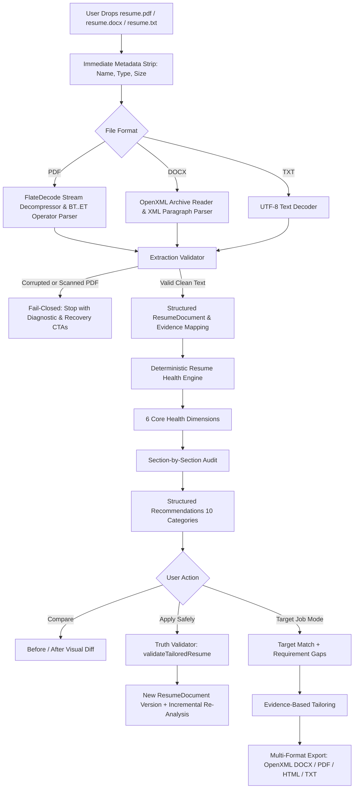

# Resumix — Real-Time Resume Intelligence & Evidence-Based Tailoring

<div align="center">


<p align="center">
  <b>A real-time resume intelligence platform, deterministic ATS optimization engine, and evidence-first tailoring system.</b>
  <br />
  <i>The uploaded resume is the source of truth. AI is an assistant for phrasing and enhancement, not a database of fabricated facts.</i>
</p>

</div>

---

## Table of Contents

- [Overview](#overview)
- [Architecture & Processing Pipeline](#architecture--processing-pipeline)
- [Core Capabilities](#core-capabilities)
  - [1. Real-Time Resume Intelligence](#1-real-time-resume-intelligence)
  - [2. Fail-Closed Extraction Engine](#2-fail-closed-extraction-engine)
  - [3. Deterministic ATS Scoring](#3-deterministic-ats-scoring)
  - [4. Section-by-Section Analysis Inspector](#4-section-by-section-analysis-inspector)
  - [5. User Control & 4 Non-Destructive Views](#5-user-control--4-non-destructive-views)
  - [6. Safe 1-Click Recommendation Apply](#6-safe-1-click-recommendation-apply)
  - [7. Professional 5-Template Engine](#7-professional-5-template-engine)
  - [8. Optimization History & Provenance](#8-optimization-history--provenance)
  - [9. Privacy & Isolated Learning Events](#9-privacy--isolated-learning-events)
- [Tech Stack](#tech-stack)
- [Directory Structure](#directory-structure)
- [Getting Started](#getting-started)
  - [Prerequisites](#prerequisites)
  - [Installation](#installation)
  - [Environment Variables](#environment-variables)
  - [Running the Application](#running-the-application)
- [Testing & Quality Verification](#testing--quality-verification)
- [Anti-Fabrication & Truth Preservation](#anti-fabrication--truth-preservation)
- [License](#license)

---

## Overview

Most modern resume tools suffer from severe AI hallucinations: they fabricate unverified technical skills, invent arbitrary metrics, generate unparseable formatting, and award inflated, meaningless ATS scores.

**Resumix** changes this paradigm by placing **evidence and truth preservation at the center of the architecture**:
- Every score is backed by a deterministic evaluation algorithm.
- Every recommendation points directly to an evidence trail in the uploaded document.
- Binary files (PDF, DOCX) are parsed via genuine stream decompression and OpenXML archive inspection.
- The user maintains complete control: the source resume is never silently altered.

---

## Architecture & Processing Pipeline



---

## Core Capabilities

### 1. Real-Time Resume Intelligence
- **Live Debounced Analysis**: Continuous background evaluation (400ms debounce) recalculating scores upon any text change.
- **Race Condition & Stale Overwrite Protection**: Sequential tracking using `resumeVersion`, `analysisVersion`, and ISO timestamps prevents out-of-order network responses from overwriting newer edits.
- **Dual-Mode System**:
  - **Mode A (General Resume Health)**: Evaluates standalone resume strength, structure, clarity, and readability without fabricating target job data.
  - **Mode B (Targeted Job Mode)**: When a target company, role, or job description is provided, computes deterministic requirement matching, Target Match %, and highlights critical eligibility gaps.

### 2. Fail-Closed Extraction Engine
- **PDF FlateDecode Decompressor**: Decodes compressed stream objects (`/FlateDecode`) in pure JavaScript without external CLI dependencies. Parses text extraction operators (`Tj`, `TJ`, `'`, `"`) with octal/hex escape decoding.
- **Scanned Image Detection**: Accurately detects scanned image PDFs ($>40\text{KB}$ with $<25$ words) and unreadable binary streams. Halts immediately and presents a transparent diagnostic dialog with `[Re-upload Document]` and `[Paste Resume Text]` options.
- **DOCX OpenXML Reader**: Validates the OpenXML package structure (`[Content_Types].xml`, `word/document.xml`) and extracts structured paragraphs and bullet items.

### 3. Deterministic ATS Scoring
Evaluates documents across **6 Core Dimensions**:
1. **ATS Compatibility**: Section heading standards, single-column parsing stability, contact channel presence.
2. **Content Quality**: Action verb strength, passive voice elimination, bullet density.
3. **Structure & Completeness**: Presence of Summary, Experience, Skills, Education, and Projects.
4. **Keyword Alignment**: Domain-specific terminology density.
5. **Evidence Strength**: Quantified business/engineering metrics (e.g. `%`, `$`, `ms`, scale multipliers).
6. **Recruiter Readability**: Bullet length distribution ($15$–$35$ words) and scanning hierarchy.

### 4. Section-by-Section Analysis Inspector
Provides an inspection view for the 5 fundamental resume sections:
- **Professional Summary**: Status, word count, candidate positioning.
- **Work Experience**: Professional roles analyzed, unquantified bullets count, passive verb count.
- **Projects & Portfolio**: Technical implementations identified, technology tags mapped.
- **Technical Skills**: Verified skills with evidence links.
- **Education**: Academic degrees, institutions, graduation dates.

Each section card provides:
- Evaluated status (`VERIFIED`, `NEEDS_IMPROVEMENT`, `WARNING`, `MISSING`).
- Entries analyzed count (e.g., `8 entries analyzed`).
- Actionable improvement count (e.g., `2 improvement opportunities`).
- `[View Recommendations]` quick-filter shortcut.

### 5. User Control & 4 Non-Destructive Views
The system guarantees that the user's original document is **never silently modified**. The workspace provides 4 dedicated view modes:
1. **Analyzed Resume**: Score meters, structural metrics breakdown, and section-by-section audit.
2. **Original Resume**: Untouched source text with character/word metrics and explicit zero-silent-modification guarantee.
3. **Suggested Improvements**: Prioritized recommendation cards with Before/After visual comparison and safe 1-click apply.
4. **Tailored Resume**: Professional preview of the job-aligned tailored document with instant template switching.

### 6. Safe 1-Click Recommendation Apply
- **10 Actionable Categories**: `STRUCTURE`, `CONTENT`, `ATS`, `KEYWORD`, `CLARITY`, `IMPACT`, `EVIDENCE`, `FORMATTING`, `MISSING_INFORMATION`, `TARGET_ALIGNMENT`.
- **Mandatory Anti-Fabrication Questions Answered for Every Finding**:
  1. *What is the problem?*
  2. *Why does it matter?*
  3. *What evidence supports this?*
  4. *What can Resumix safely change?*
  5. *What will Resumix NOT invent?*
- **Hard Truth Gating**: Applying any recommendation triggers `validateTailoredResume` before committing the change. Dates, employer names, degrees, and verified metrics are protected from unwanted alterations.

### 7. Professional 5-Template Engine
Renders the verified `ResumeDocument` into 5 professional formats:
- **ATS Classic**: Traditional serif typography, horizontal section dividers, maximum ATS parsing fidelity.
- **Modern Pro**: Contemporary sans-serif aesthetic with teal/slate accents and balanced spacing.
- **Technical Grid**: Prioritizes technical skills chips, categorized languages/frameworks/tools, and architecture highlights.
- **Minimal Executive**: Understated, high-signal layout with small-caps headers for senior and leadership roles.
- **Student / Fresher**: Prioritizes Education, academic achievements, coursework, and hands-on projects.

### 8. Optimization History & Provenance
- **Version Snapshots**: Persists iterations with timestamps, target role/company, ATS score delta, and applied recommendations list.
- **Restore & Compare**: Users can restore previous versions or compare score trajectories over time.
- **Provenance Verification**: Shows source document origin, extraction quality score, and validation status.

### 9. Privacy & Isolated Learning Events
- **User Ownership Isolation**: Data is partitioned under `/users/{userId}/` subcollections. A user can only access their own documents.
- **No Raw Resume Leaks**: The learning engine logs only non-PII categorical events (`RECOMMENDATION_SHOWN`, `RECOMMENDATION_ACCEPTED`, `RECOMMENDATION_DISMISSED`, `RECOMMENDATION_EDITED`, `RECOMMENDATION_APPLIED`, `USER_PROVIDED_EVIDENCE`). Raw text is sanitized before persistence.

---

## Tech Stack

| Layer | Technologies |
|---|---|
| **Frontend** | React 19, TypeScript 5.8, Tailwind CSS v4, Lucide Icons, Motion |
| **Build & Tooling** | Vite 6, esbuild, TSX |
| **Backend** | Node.js, Express 4.21, REST API |
| **Document Processing** | Custom FlateDecode PDF Decompressor, JSZip, OpenXML `docx` |
| **Database & Auth** | Firebase Auth, Cloud Firestore (client & server SDKs) |
| **AI Augmentation** | Google Gemini GenAI SDK (`@google/genai`) |

---

## Directory Structure

```
Resumix/
├── src/
│   ├── components/
│   │   ├── resume/
│   │   │   ├── ResumeIntelligenceView.tsx  # 4-Tab Control & Section-by-Section Inspector
│   │   │   └── ResumeDocumentPreview.tsx   # 5-Template Document Renderer
│   │   ├── Dashboard.tsx                  # Main Workspace & State Orchestrator
│   │   ├── ResumeUpload.tsx               # Drag & Drop with Stepper & Scanned PDF Gate
│   │   ├── TailorWizard.tsx               # Evidence-based Job Tailoring Flow
│   │   └── OptimizationHistory.tsx        # Version History & Score Analytics
│   ├── lib/
│   │   ├── pdfExtractor.ts                # FlateDecode PDF Decompressor & Scanned Detection
│   │   ├── docxExtractor.ts               # OpenXML DOCX Extraction Engine
│   │   ├── extractionValidator.ts         # Binary Anomaly & Fail-Closed Quality Gate
│   │   ├── resumeIntelligenceEngine.ts    # Real-Time Intelligence, Recommendations & Safe Apply
│   │   ├── resumeHealthEngine.ts          # 6-Dimension Health Scorer & Text Parser
│   │   ├── structuredResumeDocument.ts    # Unified ResumeDocument Model & Multi-Format Serializer
│   │   ├── atsEngine.ts                   # Deterministic ATS Compatibility & Score Calculator
│   │   ├── tailoringValidator.ts          # Fact-Preservation & Anti-Hallucination Validator
│   │   ├── requirementEngine.ts           # Job Requirement & Evidence Matching Layer
│   │   └── learningEngine/                # Privacy-Safe Categorical Learning Store
│   └── types.ts                           # Full TypeScript Type Definitions
├── tests/
│   ├── stage1-docx-extraction-integrity.mjs    # DOCX & Binary Extraction Tests (21/21)
│   ├── stage2-structured-resume-integrity.mjs  # Structured ResumeDocument & Templates (20/20)
│   ├── stage3-history-health-verification.mjs  # History & Health Engine Tests (7/7)
│   └── stage4-realtime-intelligence-verification.mjs # Real-Time Intelligence & Privacy Tests (11/11)
├── server.ts                              # Express API Endpoints & PDF/DOCX Handlers
├── package.json
└── README.md
```

---

## Getting Started

### Prerequisites
- **Node.js**: v18.0.0 or higher
- **npm**: v9.0.0 or higher

### Installation

1. Clone the repository:
```bash
git clone https://github.com/kamanasis/Resumix.git
cd Resumix
```

2. Install project dependencies:
```bash
npm install
```

### Environment Variables

Create a `.env.local` file in the project root:

```env
# Google Gemini API Key (Required for AI interpretation & wording suggestions)
GEMINI_API_KEY=your_gemini_api_key_here

# Firebase Configuration (Optional for cloud sync; falls back gracefully to in-memory)
VITE_FIREBASE_API_KEY=your_firebase_api_key
VITE_FIREBASE_AUTH_DOMAIN=your_project.firebaseapp.com
VITE_FIREBASE_PROJECT_ID=your_project_id
VITE_FIREBASE_STORAGE_BUCKET=your_project.appspot.com
VITE_FIREBASE_MESSAGING_SENDER_ID=your_messaging_sender_id
VITE_FIREBASE_APP_ID=your_app_id
```

### Running the Application

- **Development Mode** (Vite + Express API via TSX):
```bash
npm run dev
```
The application will be accessible at `http://localhost:3000`.

- **Typecheck**:
```bash
npm run lint
```

- **Production Build**:
```bash
npm run build
```

- **Start Production Server**:
```bash
npm start
```

---

## Testing & Quality Verification

Resumix maintains a comprehensive test suite enforcing truth preservation, binary integrity, ATS scoring correctness, and real-time intelligence:

```bash
# Run Stage 1: DOCX extraction, binary anomaly detection, OpenXML export
npx tsx tests/stage1-docx-extraction-integrity.mjs

# Run Stage 2: Structured ResumeDocument, 5 templates, format consistency
npx tsx tests/stage2-structured-resume-integrity.mjs

# Run Stage 3: Optimization history, 6-dimension health, ATS consistency
npx tsx tests/stage3-history-health-verification.mjs

# Run Stage 4: Real-time intelligence, PDF decompression, privacy learning events
npx tsx tests/stage4-realtime-intelligence-verification.mjs
```

### Verification Results Summary

| Suite | Tests Executed | Success Rate | Status |
|---|---|---|---|
| **Stage 1: DOCX & Extraction Integrity** | 21 Tests | 100% (21/21) | Passed |
| **Stage 2: Structured Resume & Templates** | 20 Tests | 100% (20/20) | Passed |
| **Stage 3: History & Health Engine** | 7 Comprehensive Sections | 100% (7/7) | Passed |
| **Stage 4: Real-Time Intelligence & Privacy** | 11 Core Scenarios | 100% (11/11) | Passed |
| **TypeScript Compilation (`tsc --noEmit`)** | Full Codebase | 0 Errors | Clean |
| **Production Bundle (`npm run build`)** | Vite + esbuild | 0 Errors | Clean |

---

## Anti-Fabrication & Truth Preservation

Resumix adheres to strict architectural boundaries regarding the role of AI:

| System Layer | Authority Model | AI Involvement |
|---|---|---|
| **Skills & Technologies** | Deterministic Extraction Only | **None.** Cannot claim a skill not present in the resume. |
| **Work History & Titles** | Deterministic Extraction Only | **None.** Cannot invent job roles or adjust dates. |
| **Performance Metrics** | Deterministic Verification Only | **None.** Refuses to invent percentages or metrics. |
| **ATS Score Calculation** | Mathematical Formula | **None.** Fully deterministic and reproducible. |
| **Job Requirement Gaps** | Strict Difference Comparison | **None.** Authoritatively compares resume against target JD. |
| **Wording & Phrasing** | AI Assistant | **Yes.** Rewrites passive bullets into Action Verb + Context + Outcome. |
| **Recommendation Explanations** | AI Assistant | **Yes.** Explains the rationale and impact of formatting/content updates. |

---

## License

This project is licensed under the [MIT License](LICENSE).
